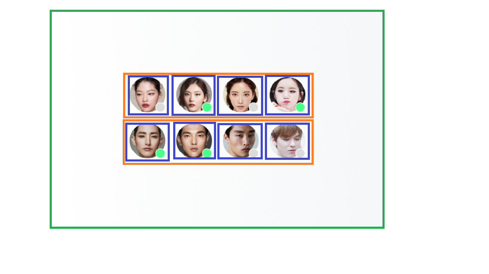

# Avatar 레이아웃 수행과정 설명(5월 3일 과제)

## HTML 마크업

HTML 구조는 아래 사진과 같이 고려하여 마크업을 진행하였습니다 

- 초록색 테두리 박스 즉, 최상위 박스를 구현하기 위해 **people-group**이라는 `class`를 가진 `section`태그를 사용하여 구현하였고 하위 그룹들을 그 아래 두었습니다.
- 각각의 아바타들을 `div`태그를 통해 여성 그룹과 남성 그룹으로 나누어 구현하였습니다.(사진에서 주황색 부분)
  - 여성 그룹은 **woman-group**이라는 `class`를 주었고 그룹 속성을 `role`속성을 통해 주었으며 `aria-label`을 통해 여성 그룹임을 표시하였습니다.
  - 남성 그룹은 **man-group**이라는 `class`를 주었고 그룹 속성을 `role`속성을 통해 주었으며 `aria-label`을 통해 남성 그룹임을 표시하였습니다.
- 사진과 상태 표시가 있는 아바타 표시 부분은 우선 `div` 박스로 묶고 class 속성으로는 **avatar-wrapper**라 주었습니다.(파란색 부분)
  - 아바타 사진 부분은 조건대로 `img`태그를 사용하여 만들었으며 `alt`속성은 여성 그룹일 때는 **여성1~4**로 남성 그룹일 때는 **남성1~4**로 설정하였습니다.
  - 상태는 `div`태그를 사용하여 작성하였으며 상태가 초록색일때는 **status-green-box**, 상태가 회색일때는 **status-grey-box**로 `class`를 부여하였습니다.

 

## CSS 스타일링

### 1. 아바타 사진과 상태창 결합 스타일링

- 아바타 사진과 상태창 스타일링을 위해 `relative`와 `absolute`를 사용하였습니다.
  - **avartar-wapper**에 `relative`를 주어서 상태 창을 `absolute`를 사용할 수 있도록 설정하였습니다.
  - 이미지는 우선 조건에서 제시한 64x64를 만들기 위해 `width`와 `height`에 각각 64px씩 주고 원형 모양을 만들기 위해 `border-radius : 100px`을 주었습니다.
  - 상태창을 사진에 겹치게 하기 위해 `absolute`를 사용하였고 top과 left에 각각 45px씩을 줘 사진과 겹치도록 하였습니다.
  - 상태창 색깔이 조건에 제시되었으므로 각각 일치하는 색상을 `background-color`를 통해 넣어주었습니다. 또한 원의 border가 white여서 color를 white를 주었습니다.

### 2. float을 사용한 레이아웃 구성

- 아바타를 구성하는 모든 `div`박스들을 **avatar-wrapper** class를 사용했기 때문에 avatar-wrapper에 `float: left`를 넣어줬습니다.
- 여성 그룹과 남성 그룹을 나누었기 때문에 각각의 class를 가진 div박스에 float은 자식이 부모의 높이를 알수 없으므로 알 수 있도록 `display: flow-root`를 줬습니다.
  - 또한 남성 그룹에는 여성 그룹에 내용들이 float 때문에 넘칠 수 있으므로 `clear: both`를 설정하였습니다.
- 조건에 아바타들의 간격은 20px로 주어졌기 때문에 avatars-wrapper에 `margin: 10px 10px`처럼 각각 상,하,좌,우 margin을 각각 10px씩 주었습니다.
  - 여기서 10px씩 준 이유는 모든 요소들이 상하좌우 다 10px씩 줬으므로 옆의 margin과 합치면 20px이 되기 때문에 10px로 설정하였습니다.
  - 이렇게 되면 가장 왼쪽 요소는 좌측이 10px이기 때문에 woman-group과 man-group의 div 박스에 `padding`을 10px 줘 모두 20px이 되도록 하였습니다.
- 예시를 보면 모든 요소가 가운데 정렬되어있기 때문에 `margin: 0 auto`를 주어 가운데 정렬을 하였고 일부는 조건에 맞게 조금씩 변경시켜 가운데 정렬을 하도록 하였습니다.

### 3. flex를 사용한 레이아웃 구성

- 우선 flex가 되는 환경에서 flex를 사용할 수 있도록 하기 위해 `@support (display:flex)`를 사용하여 설정하였습니다.
- man-group과 woman-group을 세로 즉, 열로 정렬하기 위해 가장 상위인 people-group에 `display:flex`후 `flex-flow: column nowrap`를 통해 세로 정렬을 하도록 하였습니다.
- 그리고 각각의 그룹도 그 안에 있는 아바타들에게 flex를 적용하기 위해 `display:flex`를 하였고 가로 즉, 행으로 정렬하기 위해 `flex-flow: row nowrap`를 사용하였습니다.
- 이전엔 float을 사용했고 이번엔 flex를 사용하기 때문에 float 속성은 필요없으므로 `float:none`을 하여 float을 사용하지 않도록 변경하였습니다.
- flex를 사용하면 두 그룹의 위치를 변경해야 하므로 order와 nth child를 사용하기 위해 각각 그룹의 class에 groups란 클래스를 추가하였습니다.
  - 여자 그룹의 order를 2로 설정하고 남자 그룹의 order를 1로 설정하여 서로의 위치가 변경되도록 하였습니다.
  - 변경을 하면서 float과 margin에서 차이가 발생에서 그에 맞게 margin을 변경하였습니다.

## 과제 수행 후 느낀점

- 이번주에 배웠던 내용인 float, flex, relative와 absolute 등 CSS와 관련된 요소들을 직접 써 보니 조금 더 이해가 잘 되는 것 같았다.
- 그렇게 어렵지만은 않은 과제였긴 해도 여러가지를 맞추고 확인해보는 과정이 필요해서 이런 부분이 살짝 복잡했던거 같다.
- 접근성 측면에서는 한번도 고려해보지 않았다 보니 이번 과제에서도 이렇게 쓰는 것이 맞나 여기다 이걸 추가해야하나 말아야 하는 부분들이 많았다.
